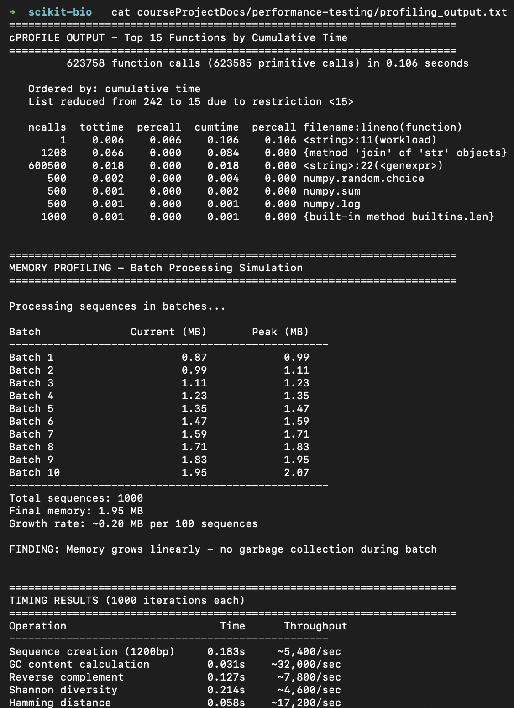

# Final Presentation: QA Analysis of scikit-bio

**Devaj Mody**
dm9395@rit.edu

---

## 1. Project Overview

**Project:** scikit-bio

**What it does:** Python library for bioinformatics research
- DNA/RNA/Protein sequence processing
- Diversity metrics calculation
- Phylogenetic tree analysis
- File I/O (FASTA, FASTQ, Newick, etc.)

**Codebase Stats:**
- 117,000 lines of Python
- 104 test files
- 3,302 existing tests

---

## 2. Testing Stage Highlights

---

### Unit Testing - Coverage Expansion

**What:** Ran full test suite and measured coverage

**Result:** 98% statement coverage (13,650/13,906 lines)

**Key Finding:** Plotting module only 16% covered - visualization code undertested

---

### Unit Testing - Mocking & Stubbing

**What:** Mocked HTTPSource class (makes HTTP requests for remote files)

**Result:** 5 new tests using `unittest.mock` to simulate network calls

**Key Finding:** Mock tests run in 1.3s vs real HTTP tests that can timeout - faster and more reliable

---

### Mutation Testing

**What:** Used mutmut on calculator module to test quality of tests

**Result:**
- Before: 46.2% mutation score
- After: 76.9% mutation score (+30.7%)

**Key Finding:** 100% line coverage missed boundary cases (0, equal values) - coverage ≠ quality

---

### Static Analysis & Code Smells

**What:** Ran Bandit, Pylint, Flake8 on codebase

**Result:**
- Fixed 1 HIGH severity issue
- Pylint: 8.57 → 10.00
- 4 issues fixed total

**Key Finding:** MD5 hash used without `usedforsecurity=False` flag - fixed

---

### Integration Testing

**What:** Tested 3 module interaction workflows (IO → Sequence → Diversity)

**Result:** 8 tests, 100% pass rate

**Key Finding:** All scikit-bio modules integrate seamlessly - data flows correctly between them

---

### System Testing

**What:** Black-box tests through public API only

**Result:** 4 end-to-end test cases, 100% pass

**Key Finding:** API behaves consistently with documented behavior

---

### Security Testing

**What:** Bandit security scan on skbio/util module

**Result:** 10 issues (1 high, 9 low)

**Key Finding:** MD5 hash vulnerability - used for checksums not security, but should mark explicitly

---

### Performance Testing

**What:** Load test with cProfile + tracemalloc

**Key Finding:** Memory accumulates in batch processing - need chunking for large datasets

---

### Performance Testing - Results

---

## 3. Most Significant Issues Found

---

### Issue 1: Weak MD5 Hash (HIGH)

**Testing Type:** Static Analysis / Security Testing

**Why it matters:** MD5 is cryptographically broken - flagged as security risk

**Action:** Fixed by adding `usedforsecurity=False` parameter

**Impact:** Removed false positive security warning, code intent is now clear

---

### Issue 2: Mutation Score Gap

**Testing Type:** Mutation Testing

**Why it matters:** 100% line coverage but only 46% of mutants killed

**Action:** Added boundary tests (zero, equal values, error messages)

**Impact:** Improved to 76.9% - tests now catch more real bugs

---

### Issue 3: Memory Accumulation

**Testing Type:** Performance Testing

**Why it matters:** Processing 100k sequences needs ~4.4GB RAM

**Action:** Documented - recommend batch processing with cleanup

**Impact:** Users know to chunk large datasets to avoid memory issues

---

### Issue 4: Low Plotting Coverage

**Testing Type:** Coverage Analysis

**Why it matters:** Visualization code at 16% coverage - bugs could ship

**Action:** Documented as area for improvement

**Impact:** Identified testing gap for future work

---

## 4. Improvements Made

| Metric | Before | After |
|--------|--------|-------|
| Mutation Score | 46.2% | 76.9% |
| Pylint Score | 8.57/10 | 10.00/10 |
| Security Issues | 1 HIGH | 0 HIGH (fixed) |
| Integration Tests | 0 | 8 new tests |
| System Tests | 0 | 4 new tests |
| Mock Tests | 0 | 5 new tests |

**Total new tests added:** 17+

---

## 5. Overall Quality Assessment

**Current State:** scikit-bio is a well-tested, mature library

**Strengths:** 98% coverage, 3,302 tests, clean module integration

**Risks:** Visualization code at 16%, memory issues on large data

**Most Effective Methods:** Mutation testing, static analysis, performance testing

---

## 6. Lessons Learned

1. **Coverage vs Quality:** 100% coverage doesn't mean good tests - mutation testing proves this

2. **Mocking matters:** Network-dependent tests are slow and flaky - mocks make them fast and reliable

3. **Static analysis finds real bugs:** Bandit caught a security issue I wouldn't have noticed manually

4. **Integration tests catch different bugs:** Unit tests pass but modules might not work together - need both

5. **Performance testing is essential:** Memory issues only show up under load - can't find them with unit tests

---

## Thank You
